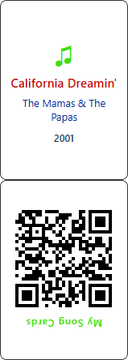

<h1>🎵 Music Cards</h1>


> Turn any Spotify playlist — or your Liked Songs — into a printable deck of cards for a music **guessing game**.

---

## 📖 About



**Music Cards** generates printable, double-sided cards from your Spotify music:

- **One side** — a **QR code** that opens the track in Spotify.
- **Other side** — the song's **title, artist, and release year** (the answer).

Print the deck, cut the cards out, and play: scan a QR code to hear the song, guess its details, then flip the card to check.

<sub><em>↑ An example card — front (song details) and back (QR code).</em></sub>

<br clear="all" />

---

## 🎴 Playing the cards

Once your deck is printed, there are two ways to play:

- **📱 Scan with your phone** — Scanning a card's QR code opens the Spotify app and starts playing the song. Works with any QR scanner.
- **🎯 Use the companion player** — For a smoother experience, my separate **[Music Cards Player](https://github.com/talseg/music-cards-player)** project lets you play and guess each song's details **without opening the Spotify app**.

---

## 🎮 Features

- 🎧 Import songs from a **Spotify playlist** or your **Liked Songs**.
- 🖨️ Export a **print-ready PDF** of double-sided cards (QR + song details).
- 📅 Optional **AI release-year lookup** so you don't have to research dates by hand.
- ⏯️ **Pause / resume** the AI lookup at any time.

---

## 🚀 Getting Started

<details>
<summary><strong>✅ Prerequisites</strong></summary>

<br>

- A paid **[Spotify Premium](https://open.spotify.com/)** account.
- **[Git](https://git-scm.com/)**
- **[Node.js LTS](https://nodejs.org/)**

</details>

<details>
<summary><strong>🟢 Spotify Developer setup</strong></summary>

<br>

1. Sign in to the **[Spotify Developer Dashboard](https://developer.spotify.com/dashboard)**.
2. **Create app** → fill in any App name and description.
3. Copy the **Client ID** and **Client Secret** (you'll need them for `.env`).
4. Under **Redirect URIs**, add both of these (replace `<your-ip-address>`):
   - `https://<your-ip-address>:5173/callback` &nbsp;(for `npm run dev`)
   - `https://<your-ip-address>:4173/callback` &nbsp;(for `npm run preview`)
5. Under **Which API/SDKs are you planning to use?**, check **Web API** and **Web Playback SDK**.
6. Be sure to scroll down and Click **Save**.
7. Open the **User Management** tab and add the name + email of every Spotify account that will use the app.

> ⚠️ **Common pitfall:** your IP address can change after a reboot. If it does, you **must** add the new IP to the Redirect URIs above.

</details>

<details>
<summary><strong>🔍 Finding your IP address</strong></summary>

<br>

```bash
ipconfig | findstr IPv4
# IPv4 Address. . . . . . . . . . . : <this-is-your-ip-address>
```

</details>

<details>
<summary><strong>🛠️ Project setup</strong></summary>

<br>

**1. Clone and install**

```bash
git clone https://github.com/talseg/music-cards.git
cd music-cards
npm install
```

**2. Create a `.env` file in the project root** (next to `package.json` — **not** inside `src/`):

```bash
# Spotify — required
VITE_SPOTIFY_CLIENT_ID=your_spotify_client_id
SPOTIFY_CLIENT_SECRET=your_spotify_client_secret

# AI release-year lookup — optional (see "AI Dates" below)
VITE_DATES_ENABLED=true
PERPLEXITY_API_KEY=your_perplexity_api_key
```

> 🔒 `SPOTIFY_CLIENT_SECRET` and `PERPLEXITY_API_KEY` have **no** `VITE_` prefix on purpose — they are read server-side by the Vite proxy and never reach the browser.

</details>

### ▶️ Running the app

```bash
# Development
npm run dev        # → https://<your-ip-address>:5173

# Production preview
npm run build
npm run preview    # → https://<your-ip-address>:4173
```

> ℹ️ The app runs over **HTTPS** with a self-signed certificate, so your browser will show a security warning on first visit — accept it to continue.
>
> 🚫 Open it via your **IP address**, not `https://localhost:5173`.

---

## 🤖 AI Dates (advanced — optional)

A powerful but optional feature that auto-fills each song's original release year, so you don't have to research dates by hand. Most users won't need it — but it's there if you want it. Expand below to set it up.

<details>
<summary><strong>⚙️ Setup, options &amp; costs</strong></summary>

<br>

Lookups run through the **[Perplexity Agent API](https://docs.perplexity.ai/)**, using the cheapest available model — **`google/gemini-3.1-flash-lite`**. You can switch to a different model by changing the `MODEL` variable in [`src/perplexityDates.ts`](./src/perplexityDates.ts).

**Enable it** by setting both of these in your `.env`:

```bash
VITE_DATES_ENABLED=true
PERPLEXITY_API_KEY=your_perplexity_api_key   # from the Perplexity API dashboard
```

Once enabled, two options appear:

| Option | What it does | Cost |
| --- | --- | --- |
| **Get AI dates** | Bulk-fills years from the AI model's own knowledge. Pause / resume any time. | ~0.007¢ per song |
| **Web search** 🔍 | Per-song lookup using a live web search — more accurate for obscure tracks. | ~0.5¢ per query |

> 💡 **Web search is off by default** and must be toggled on (with a confirmation prompt) — each query costs far more than a regular lookup (≈70×, per the table above).

If `VITE_DATES_ENABLED` is absent or not exactly `true`, the entire AI feature stays hidden.

</details>

---

## 🕹️ Usage & Tips

- **Edit cards inline** — Click the **title**, **artist**, or **year** directly on the preview card to edit it. Changes save as soon as you click away.

- **Export playlist needs login** — The **Export playlist** field (load every song from a Spotify playlist or your Liked Songs) only works when you're signed in to Spotify. The **Add song** field works without logging in, for adding tracks one at a time.

- **Pick which year prints (AI mode)** — Each song row shows two suggested years side by side: the **Spotify** year and the **AI** year. Click either value to set it as the year printed on the card (shown in the **Card** column).

- **Copy button (⧉)** — Copies a ready-made search string — `song <title> <artist> first official release date` — to your clipboard. Paste it into your browser to quickly look up a song's release date.

- **Song counter** — The +/− counter is a manual tally for tracking your place while adding songs by hand (e.g. which number you're on in a physical list). It persists between sessions.

- **Sheet count** — Shows how many pages your deck fills, at 4 cards per sheet. It's rounded up to the nearest quarter, so a value like `1.25 sheets` tells you the last page is only partly filled — handy for not wasting paper.

---

## 📜 License

This project is released under the [MIT License](./LICENSE).

- ✅ Free for personal use, learning, and contributions.
- 🚫 Not allowed: publishing as an app on Google Play, Apple App Store, or similar platforms.

🤝 **Want to contribute?** I'd be happy to have you on board — email **[talseg7@gmail.com](mailto:talseg7@gmail.com)** and we'll take it from there.

---

## ⚖️ Disclaimer

- **Non-commercial hobby project.** Music Cards is a personal, non-commercial project provided "as is", for personal use only. Generated cards are **not for resale**.
- **Not affiliated with Spotify.** This is an independent project, not affiliated with, endorsed by, or sponsored by Spotify. "Spotify" is a trademark of Spotify AB. Use of the Spotify API is subject to Spotify's [Developer Terms](https://developer.spotify.com/terms) and Design Guidelines.
- **No music is hosted or distributed.** The app stores and streams no audio. Cards contain only text (title, artist, year) and a QR code that links to Spotify — no album artwork or other copyrighted images. All music and related rights remain with their respective owners, and playback happens through your own Spotify account.
- **Independent design.** This is an original, independently built project. No third-party names, logos, branding, or song selections are used.
- **Your responsibility.** You are responsible for your own use of the app and the codes and cards it generates, including complying with Spotify's terms and any applicable laws.
- **Not legal advice.** This notice is provided for transparency and does not constitute legal advice.

---

## 🙏 Acknowledgments

- Built by **Tal Segal** with React, TypeScript, and [Vite](https://vitejs.dev/).
- Developed with the help of **Anthropic Claude**.

---
